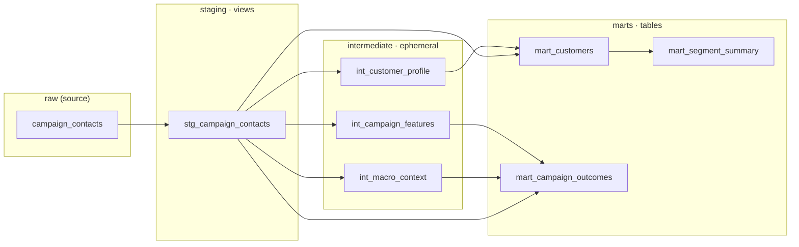

# Bank Campaign Causal Intelligence

## Overview

An analytics-engineering project on the [UCI Bank Marketing dataset](https://archive.ics.uci.edu/dataset/222/bank+marketing)
(~41,000 contacts from a Portuguese bank's direct-marketing campaigns). The
data is ingested into BigQuery, modelled with dbt, and analysed for the causal
effect of the campaign — not just its correlation with subscriptions.

## The Question

> **Did the marketing campaign actually work, or did the bank just keep calling
> people who would have said yes anyway?**

The headline metric (whether a client subscribed to a term deposit) is easy to
correlate with contact activity. The harder, more honest question is *causal*:
how much of the observed uplift is attributable to the campaign itself versus
selection effects in who got contacted. That analysis is the centrepiece
(Day 5).

Two data hazards are handled explicitly from day one:

- **`duration` is leakage.** Call duration is only known *after* a call ends, so
  it trivially predicts the outcome. It is flagged and excluded from all
  causal/predictive work.
- **`pdays == 999` is a sentinel**, not a real value — it means the client was
  never previously contacted. It is loaded as-is into `raw` and converted to
  `NULL` in the staging layer.

## Stack

| Layer            | Tool                                    |
| ---------------- | --------------------------------------- |
| Warehouse        | Google BigQuery (free tier)             |
| Ingestion        | Python (`google-cloud-bigquery`, pandas)|
| Transformation   | dbt (`dbt-bigquery`), layered raw → staging → marts |
| Analysis         | scikit-learn, scipy, statsmodels-style causal methods |
| Visualisation    | matplotlib, seaborn, Streamlit, Power BI|
| Narrative / docs | Anthropic API                           |

Auth is via a **service account** (not user auth) for reproducibility, and the
BigQuery schema is **explicitly typed** (no autodetect).

## Data Model

The dbt project is layered raw → staging → intermediate → marts. Staging models
are **views** (cheap, always-fresh cleaning), intermediate models are
**ephemeral** (compiled into CTEs, never materialised), and marts are **tables**
(the stable analysis surface). No `SELECT *` anywhere — every column is explicit
at every layer.



| Mart | Grain | What it's for |
| ---- | ----- | ------------- |
| `mart_customers` | one row per contact | Demographic + financial profile and the subscription outcome — the customer-centric view. |
| `mart_campaign_outcomes` | one row per contact | Campaign features + macro context + outcome — the primary analysis table for Days 3–5, including the **causal** work (the macro columns are the confounders). |
| `mart_segment_summary` | one row per (job × age_bucket × education) | Subscription rate, contacts, and subscribers per segment — quick segmentation views. |

Two hazards are encoded in the models, not just the docs: `duration` is dropped
at the mart layer as a **leakage** feature, and `pdays == 999` becomes
`days_since_last_contact = NULL` with an explicit `was_previously_contacted`
flag. Both are enforced by tests (`dbt test` → **31 passing**), including custom
singular tests asserting the overall subscription rate is plausible (~11%) and
that the pdays-null/flag invariant holds.

### Generated documentation

`dbt docs generate && dbt docs serve` produces a browsable catalog with every
mart column described and every test surfaced:


## Project Structure

```
bank-campaign-causal-intelligence/
├── data/raw/                       # source CSV (git-ignored)
├── src/
│   └── ingest.py                   # CSV -> BigQuery raw.campaign_contacts
├── dbt/
│   └── bank_campaign/              # dbt project (dbt-bigquery)
│       ├── dbt_project.yml
│       ├── profiles.yml            # service-account auth, raw/staging/marts
│       ├── macros/
│       │   └── generate_schema_name.sql
│       ├── models/
│       │   ├── staging/            # stg_ views: cleaned, typed, 1:1 with raw
│       │   ├── intermediate/       # int_ ephemeral: profile / campaign / macro
│       │   └── marts/              # mart_ tables: analysis-ready
│       └── tests/                  # custom singular tests
├── notebooks/                      # exploratory analysis
├── dashboards/                     # Streamlit / Power BI artifacts
├── credentials/                    # service-account key (git-ignored)
├── requirements.txt
└── README.md
```

## Status

**Day 2 of 7 — dbt modelling layer complete.**

- [x] Project scaffolding, `.gitignore`, pinned `requirements.txt`
- [x] Python ingestion script with explicit BigQuery schema
- [x] dbt project initialised (raw / staging / marts), service-account auth
- [x] Full dbt DAG: staging (views) → intermediate (ephemeral) → marts (tables)
- [x] Tests pass 100% (`dbt test` → 31/31), incl. 2 custom singular tests
- [x] Browsable `dbt docs` with every mart column documented
- [ ] Days 3–4: EDA & predictive modelling (leakage-aware)
- [ ] Day 5: **causal analysis** — campaign effect vs. selection, adjusting for macro confounders
- [ ] Days 6–7: dashboard & write-up

## Setup

1. Create a GCP project `bank-campaign-causal` with BigQuery enabled (free tier).
2. Create a service account, grant it **BigQuery Data Editor** + **BigQuery Job
   User**, download its JSON key to `credentials/service-account.json`.
3. Create and populate the environment:
   ```powershell
   python -m venv .venv
   .\.venv\Scripts\Activate.ps1
   pip install -r requirements.txt
   $env:GCP_PROJECT_ID = "bank-campaign-causal"
   $env:GOOGLE_APPLICATION_CREDENTIALS = "$PWD\credentials\service-account.json"
   ```
4. Ingest the data:
   ```powershell
   python src/ingest.py
   ```
5. Verify the dbt connection:
   ```powershell
   cd dbt/bank_campaign
   $env:DBT_GCP_KEYFILE = "$PWD\..\..\credentials\service-account.json"
   dbt debug --profiles-dir .
   dbt run --profiles-dir .
   ```

## Headline Findings

_TBD — populated after the Day 5 causal analysis._
