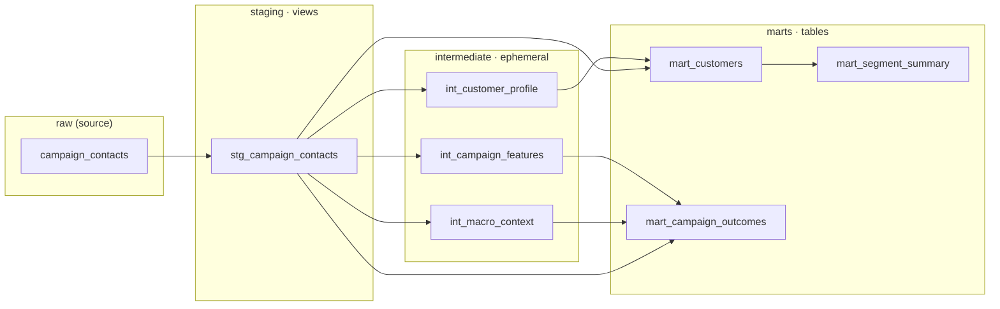

# Bank Campaign Causal Intelligence

## Overview

An analytics-engineering project on the [UCI Bank Marketing dataset](https://archive.ics.uci.edu/dataset/222/bank+marketing)
(~41,000 contacts from a Portuguese bank's direct-marketing campaigns). The
data is ingested into BigQuery, modelled with dbt, and analysed for the causal
effect of the campaign — not just its correlation with subscriptions.

## The Question

> **Did the marketing campaign actually work, or did the bank just keep calling
> people who would have said yes anyway?**

The headline metric (whether a client subscribed to a term deposit) is easy to
correlate with contact activity. The harder, more honest question is *causal*:
how much of the observed uplift is attributable to the campaign itself versus
selection effects in who got contacted. That analysis is the centrepiece
(Day 5).

Two data hazards are handled explicitly from day one:

- **`duration` is leakage.** Call duration is only known *after* a call ends, so
  it trivially predicts the outcome. It is flagged and excluded from all
  causal/predictive work.
- **`pdays == 999` is a sentinel**, not a real value — it means the client was
  never previously contacted. It is loaded as-is into `raw` and converted to
  `NULL` in the staging layer.

> **The Day 3 punchline** ([full findings →](#headline-findings)): the campaign's
> most flattering numbers are also its most confounded. Calling clients *more*
> tracks *lower* subscription (13.0% → 5.5%), and a single pre-existing signal —
> prior-campaign success — converts at **5.8× the base rate**. Sorting real
> effect from selection is what Day 5 is for.

## Stack

| Layer            | Tool                                    |
| ---------------- | --------------------------------------- |
| Warehouse        | Google BigQuery (free tier)             |
| Ingestion        | Python (`google-cloud-bigquery`, pandas)|
| Transformation   | dbt (`dbt-bigquery`), layered raw → staging → marts |
| Analysis         | scikit-learn, scipy, statsmodels-style causal methods |
| Visualisation    | matplotlib, seaborn, Streamlit, Power BI|
| Narrative / docs | Anthropic API                           |

Auth is via a **service account** (not user auth) for reproducibility, and the
BigQuery schema is **explicitly typed** (no autodetect).

## Data Model

The dbt project is layered raw → staging → intermediate → marts. Staging models
are **views** (cheap, always-fresh cleaning), intermediate models are
**ephemeral** (compiled into CTEs, never materialised), and marts are **tables**
(the stable analysis surface). No `SELECT *` anywhere — every column is explicit
at every layer.



| Mart | Grain | What it's for |
| ---- | ----- | ------------- |
| `mart_customers` | one row per contact | Demographic + financial profile and the subscription outcome — the customer-centric view. |
| `mart_campaign_outcomes` | one row per contact | Campaign features + macro context + outcome — the primary analysis table for Days 3–5, including the **causal** work (the macro columns are the confounders). |
| `mart_segment_summary` | one row per (job × age_bucket × education) | Subscription rate, contacts, and subscribers per segment — quick segmentation views. |

Two hazards are encoded in the models, not just the docs: `duration` is dropped
at the mart layer as a **leakage** feature, and `pdays == 999` becomes
`days_since_last_contact = NULL` with an explicit `was_previously_contacted`
flag. Both are enforced by tests (`dbt test` → **31 passing**), including custom
singular tests asserting the overall subscription rate is plausible (~11%) and
that the pdays-null/flag invariant holds.

### Generated documentation

`dbt docs generate && dbt docs serve` produces a browsable catalog with every
mart column described and every test surfaced:


## Project Structure

```
bank-campaign-causal-intelligence/
├── data/raw/                       # source CSV (git-ignored)
├── src/
│   └── ingest.py                   # CSV -> BigQuery raw.campaign_contacts
├── dbt/
│   └── bank_campaign/              # dbt project (dbt-bigquery)
│       ├── dbt_project.yml
│       ├── profiles.yml            # service-account auth, raw/staging/marts
│       ├── macros/
│       │   └── generate_schema_name.sql
│       ├── models/
│       │   ├── staging/            # stg_ views: cleaned, typed, 1:1 with raw
│       │   ├── intermediate/       # int_ ephemeral: profile / campaign / macro
│       │   └── marts/              # mart_ tables: analysis-ready
│       └── tests/                  # custom singular tests
├── notebooks/                      # Day 3 EDA, runs against BigQuery
│   ├── 01_subscription_landscape.ipynb   # who subscribes (demographics)
│   └── 02_campaign_strategy.ipynb        # which tactics look effective
├── reports/figures/                # exported chart PNGs (~10)
├── docs/
│   └── findings.md                 # quantified findings write-up (Section 1)
├── dashboards/                     # Streamlit / Power BI artifacts
├── credentials/                    # service-account key (git-ignored)
├── requirements.txt
└── README.md
```

## Status

**Day 3 of 7 — descriptive analytics complete.**

- [x] Project scaffolding, `.gitignore`, pinned `requirements.txt`
- [x] Python ingestion script with explicit BigQuery schema
- [x] dbt project initialised (raw / staging / marts), service-account auth
- [x] Full dbt DAG: staging (views) → intermediate (ephemeral) → marts (tables)
- [x] Tests pass 100% (`dbt test` → 31/31), incl. 2 custom singular tests
- [x] Browsable `dbt docs` with every mart column documented
- [x] Day 3: descriptive EDA — subscription landscape & campaign strategy, ~10
      figures, quantified findings ([`docs/findings.md`](docs/findings.md))
- [ ] Day 4: predictive modelling (leakage-aware)
- [ ] Day 5: **causal analysis** — campaign effect vs. selection, adjusting for macro confounders
- [ ] Days 6–7: dashboard & write-up

## Setup

1. Create a GCP project `bank-campaign-causal` with BigQuery enabled (free tier).
2. Create a service account, grant it **BigQuery Data Editor** + **BigQuery Job
   User**, download its JSON key to `credentials/service-account.json`.
3. Create and populate the environment:
   ```powershell
   python -m venv .venv
   .\.venv\Scripts\Activate.ps1
   pip install -r requirements.txt
   $env:GCP_PROJECT_ID = "bank-campaign-causal"
   $env:GOOGLE_APPLICATION_CREDENTIALS = "$PWD\credentials\service-account.json"
   ```
4. Ingest the data:
   ```powershell
   python src/ingest.py
   ```
5. Verify the dbt connection:
   ```powershell
   cd dbt/bank_campaign
   $env:DBT_GCP_KEYFILE = "$PWD\..\..\credentials\service-account.json"
   dbt debug --profiles-dir .
   dbt run --profiles-dir .
   ```
6. Run the Day-3 analysis notebooks (each queries BigQuery and regenerates the
   ~10 PNGs in `reports/figures/` plus the numbers behind `docs/findings.md`):
   ```powershell
   $env:GOOGLE_APPLICATION_CREDENTIALS = "$PWD\credentials\service-account.json"
   jupyter nbconvert --to notebook --execute --inplace `
     notebooks\01_subscription_landscape.ipynb `
     notebooks\02_campaign_strategy.ipynb
   ```

## Headline Findings

> Full quantified write-up: **[`docs/findings.md`](docs/findings.md)** ·
> reproduced live from BigQuery in **[`notebooks/`](notebooks/)**. Every rate is
> anchored to the **11.3% overall subscription base rate** (4,640 / 41,188
> contacts).

**The campaign's most "effective" tactics are exactly where selection bias
hides — which is the whole point of this project.**

- **More calls, _fewer_ subscriptions.** Subscription falls *monotonically* from
  **13.0% on the 1st contact to 5.5% at 6+ contacts**. The intuitive
  "persistence pays" story isn't even directionally true — a textbook signature
  of reverse causation (clients who say yes leave the call list, so high contact
  counts pile up among the hard "no"s).

  

- **One variable dwarfs everything: prior success.** Clients whose *previous*
  campaign ended in success subscribe at **65.1% — 5.8× the base rate** — versus
  8.8% for never-contacted clients. The dominant predictor *and* the dominant
  confounder for the Day 5 causal work.

  

- **Demographics are life-stage, not marketing.** Students (31.4%) and retired
  clients (25.2%) convert 2–3× base; blue-collar workers (6.9%) convert below it
  — a **4.6× spread** that mostly tracks age, not any contact strategy.
- **Channel looks decisive — on the surface.** Cellular converts at **14.7% vs
  5.2%** for telephone (2.8×), but channel is entangled with era and client mix.
- **Timing is a volume mirage.** May carries **33% of all contacts at a
  below-base 6.4% rate**, while sub-2%-volume months (Mar, Sep, Oct, Dec) convert
  at 44–51%. Reading the rate alone would point you at exactly the wrong month.

Every one of these is a *correlation with a selection story attached*.
Quantifying how much survives adjustment for confounders — i.e. whether the
campaign actually **worked** — is the Day 5 centrepiece.
