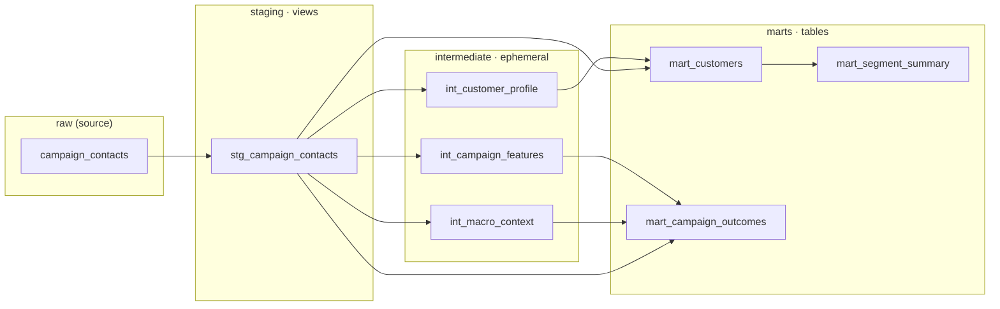
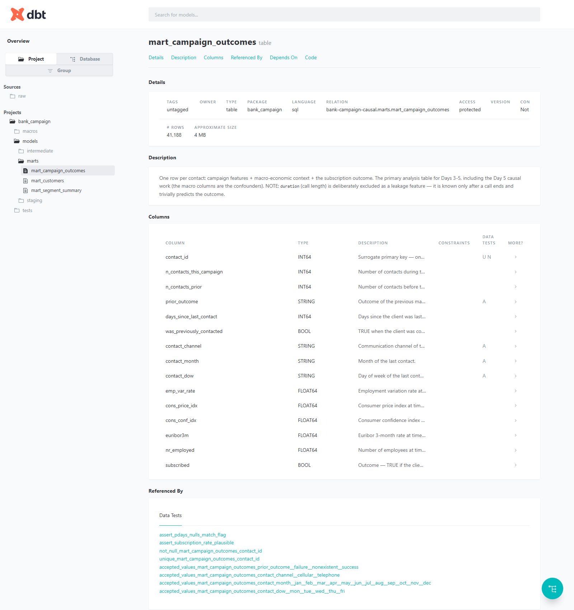
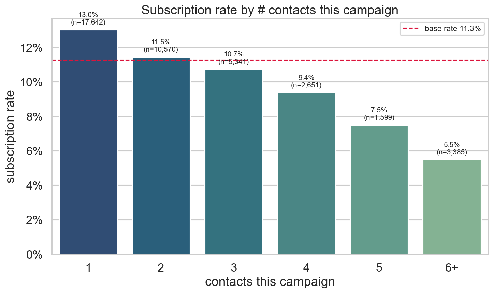
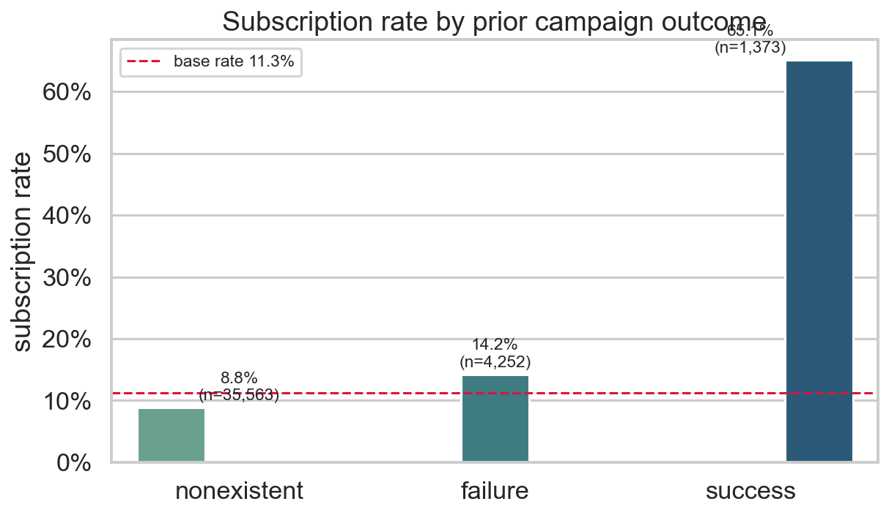

# Bank Campaign Causal Intelligence

## Overview

An analytics-engineering project on the [UCI Bank Marketing dataset](https://archive.ics.uci.edu/dataset/222/bank+marketing)
(about 41,000 contacts from a Portuguese bank's direct-marketing campaigns). The
data is loaded into BigQuery, modelled with dbt, and analysed for the *causal*
effect of the campaign rather than just its correlation with subscriptions.

## The Question

> Did the marketing campaign actually work, or did the bank mostly keep calling
> people who would have said yes anyway?

Whether a client subscribed to a term deposit is easy to correlate with contact
activity. The harder question is causal: how much of the observed uplift comes
from the campaign itself versus selection in who got contacted. That is the
focus of the causal analysis.

Two data hazards are handled from the start:

- `duration` is leakage. Call duration is only known after a call ends, so it
  trivially predicts the outcome. It is flagged and excluded from all
  causal/predictive work.
- `pdays == 999` is a sentinel, not a real value. It means the client was never
  previously contacted. It is loaded as-is into `raw` and converted to `NULL` in
  the staging layer.

A short preview of what the analysis found ([full write-up](#headline-findings)):
calling clients more often goes with *lower* subscription (13.0% down to 5.5%),
and a single pre-existing signal, prior-campaign success, converts at about 5.8x
the base rate. Separating real effect from selection is the job of the causal
analysis below.

## Stack

| Layer            | Tool                                    |
| ---------------- | --------------------------------------- |
| Warehouse        | Google BigQuery (free tier)             |
| Ingestion        | Python (`google-cloud-bigquery`, pandas)|
| Transformation   | dbt (`dbt-bigquery`), layered raw to staging to marts |
| Analysis         | scikit-learn, scipy, statsmodels-style methods |
| Visualisation    | matplotlib, seaborn, Streamlit, Power BI|

Auth is via a service account (not user auth) for reproducibility, and the
BigQuery schema is explicitly typed (no autodetect).

## Data Model

The dbt project is layered raw, staging, intermediate, marts. Staging models are
views (cheap, always-fresh cleaning), intermediate models are ephemeral
(compiled into CTEs, never materialised), and marts are tables (the stable
analysis surface). There is no `SELECT *` anywhere; every column is listed
explicitly at every layer.



| Mart | Grain | What it's for |
| ---- | ----- | ------------- |
| `mart_customers` | one row per contact | Demographic and financial profile plus the subscription outcome. The customer-centric view. |
| `mart_campaign_outcomes` | one row per contact | Campaign features, macro context, and outcome. The primary analysis table for the EDA and the causal work (the macro columns are the confounders). |
| `mart_segment_summary` | one row per (job, age_bucket, education) | Subscription rate, contacts, and subscribers per segment, for quick segmentation views. |

Two hazards are encoded in the models, not just the docs: `duration` is dropped
at the mart layer as a leakage feature, and `pdays == 999` becomes
`days_since_last_contact = NULL` with an explicit `was_previously_contacted`
flag. Both are enforced by tests (`dbt test` passes 31 checks), including two
custom singular tests that assert the overall subscription rate is plausible
(around 11%) and that the pdays-null/flag invariant holds.

### Generated documentation

`dbt docs generate && dbt docs serve` produces a browsable catalog with every
mart column described and every test surfaced:



## Project Structure

```
bank-campaign-causal-intelligence/
├── data/raw/                       # source CSV (git-ignored)
├── src/
│   └── ingest.py                   # CSV -> BigQuery raw.campaign_contacts
├── dbt/
│   └── bank_campaign/              # dbt project (dbt-bigquery)
│       ├── dbt_project.yml
│       ├── profiles.yml            # service-account auth, raw/staging/marts
│       ├── macros/
│       │   └── generate_schema_name.sql
│       ├── models/
│       │   ├── staging/            # stg_ views: cleaned, typed, 1:1 with raw
│       │   ├── intermediate/       # int_ ephemeral: profile / campaign / macro
│       │   └── marts/              # mart_ tables: analysis-ready
│       └── tests/                  # custom singular tests
├── notebooks/                      # EDA + experiment analysis, runs against BigQuery
│   ├── 01_subscription_landscape.ipynb   # who subscribes (demographics)
│   ├── 02_campaign_strategy.ipynb        # which tactics look effective
│   ├── 03_experiment_design.ipynb        # contact-cap A/B test design + sample size
│   ├── 04_quasi_experiment.ipynb         # observational treatment/control + balance check
│   └── 05_causal_contact_effect.ipynb    # stratification + standardization, contact effect
├── reports/figures/                # exported chart PNGs
├── docs/
│   ├── findings.md                 # quantified findings write-up
│   └── interview_script.md         # 90-second and 30-second walk-throughs
├── dashboards/                     # Streamlit / Power BI artifacts
├── credentials/                    # service-account key (git-ignored)
├── requirements.txt
└── README.md
```

## Status

The data model and the analysis through the causal step are complete. The
dashboard and final write-up are next.

- [x] Project scaffolding, `.gitignore`, pinned `requirements.txt`
- [x] Python ingestion script with explicit BigQuery schema
- [x] dbt project set up (raw / staging / marts), service-account auth
- [x] Full dbt DAG: staging (views) to intermediate (ephemeral) to marts (tables)
- [x] Tests pass 100% (`dbt test`, 31/31), including 2 custom singular tests
- [x] Browsable `dbt docs` with every mart column documented
- [x] Descriptive EDA on the subscription landscape and campaign strategy, with
      figures and a quantified write-up ([`docs/findings.md`](docs/findings.md))
- [x] Contact-cap experiment design (sample size derived by hand) and an
      observational quasi-experiment (Wilson CIs, two-proportion z-test, and a
      chi-square balance check showing the groups are not comparable)
- [x] Causal analysis of contact frequency: stratification and standardization
      with a hand-written bootstrap, plus an interview script
      ([`docs/interview_script.md`](docs/interview_script.md))
- [ ] Dashboard and final write-up

## Setup

1. Create a GCP project `bank-campaign-causal` with BigQuery enabled (free tier).
2. Create a service account, grant it BigQuery Data Editor and BigQuery Job
   User, download its JSON key to `credentials/service-account.json`.
3. Create and populate the environment:
   ```powershell
   python -m venv .venv
   .\.venv\Scripts\Activate.ps1
   pip install -r requirements.txt
   $env:GCP_PROJECT_ID = "bank-campaign-causal"
   $env:GOOGLE_APPLICATION_CREDENTIALS = "$PWD\credentials\service-account.json"
   ```
4. Ingest the data:
   ```powershell
   python src/ingest.py
   ```
5. Verify the dbt connection:
   ```powershell
   cd dbt/bank_campaign
   $env:DBT_GCP_KEYFILE = "$PWD\..\..\credentials\service-account.json"
   dbt debug --profiles-dir .
   dbt run --profiles-dir .
   ```
6. Run the analysis notebooks (each queries BigQuery and regenerates the PNGs in
   `reports/figures/` plus the numbers behind `docs/findings.md`):
   ```powershell
   $env:GOOGLE_APPLICATION_CREDENTIALS = "$PWD\credentials\service-account.json"
   jupyter nbconvert --to notebook --execute --inplace `
     notebooks\01_subscription_landscape.ipynb `
     notebooks\02_campaign_strategy.ipynb `
     notebooks\03_experiment_design.ipynb `
     notebooks\04_quasi_experiment.ipynb `
     notebooks\05_causal_contact_effect.ipynb
   ```

## Headline Findings

Full write-up: [`docs/findings.md`](docs/findings.md), reproduced live from
BigQuery in the [`notebooks/`](notebooks/). Every rate is compared against the
overall subscription base rate of 11.3% (4,640 of 41,188 contacts).

The short version: the tactics that look most effective at first glance are also
the ones most affected by selection bias, which is what makes the causal step
worth doing.

- More calls go with fewer subscriptions. The subscription rate falls steadily
  from 13.0% on the 1st contact to 5.5% at 6 or more contacts. The "persistence
  pays" story is not even directionally true in the raw data, which is what you
  would expect if clients who say yes leave the call list and the high contact
  counts pile up among the harder "no" cases.

  

- Prior success is the strongest signal. Clients whose previous campaign ended in
  success subscribe at 65.1%, about 5.8x the base rate, versus 8.8% for clients
  never contacted before. It is the strongest predictor and also the strongest
  confounder for the causal analysis.

  

- Demographics mostly reflect life stage. Students (31.4%) and retired clients
  (25.2%) convert 2 to 3 times the base rate, while blue-collar workers (6.9%)
  convert below it, a 4.6x spread that largely tracks age rather than any contact
  strategy.
- Channel looks decisive on the surface. Cellular converts at 14.7% versus 5.2%
  for telephone (2.8x), but channel is mixed up with era and client type.
- Timing is mostly volume. May holds 33% of all contacts at a below-base 6.4%
  rate, while low-volume months (Mar, Sep, Oct, Dec, each under 2% of contacts)
  convert at 44 to 51%. Reading the rate without the volume would point you at
  the wrong month.

Each of these is a correlation with a selection story behind it. The causal
analysis measures how much survives once the confounders are accounted for. For
contact frequency, the naive effect of more contacts is -3.74pp, but after
stratifying by prior engagement and standardizing (with a hand-written
bootstrap), it shrinks to -2.39pp [95% CI -2.98, -1.76]. About a third of the
apparent harm was selection (easy converters leaving the call list early), and a
smaller, still-negative effect remains. Details in
[`docs/findings.md`](docs/findings.md) Section 5.
